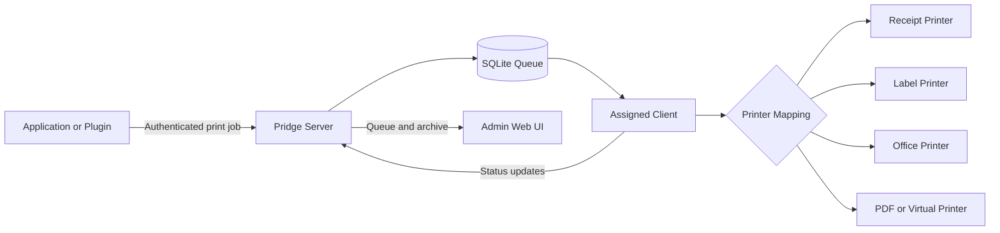
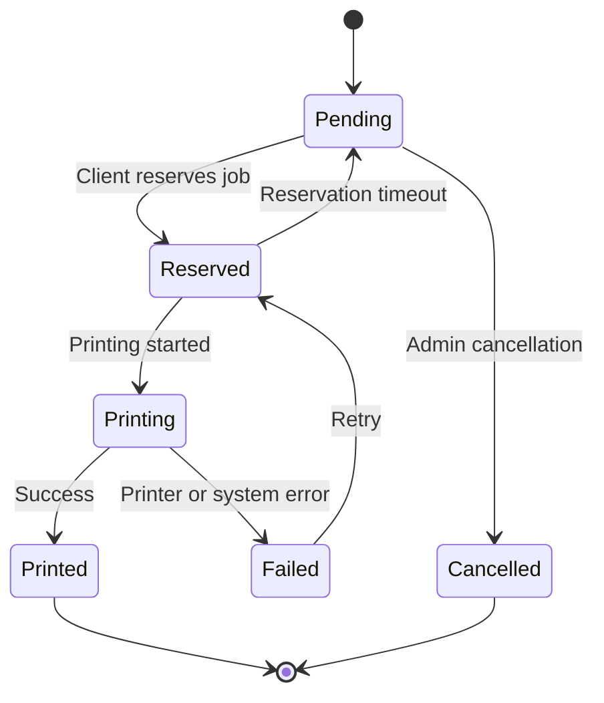
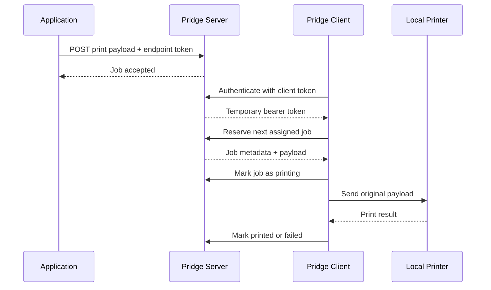
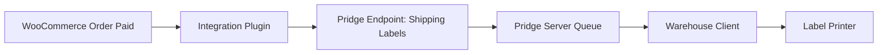
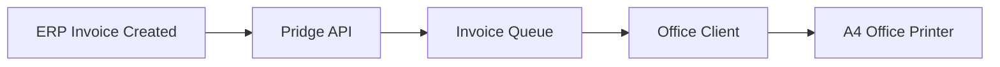
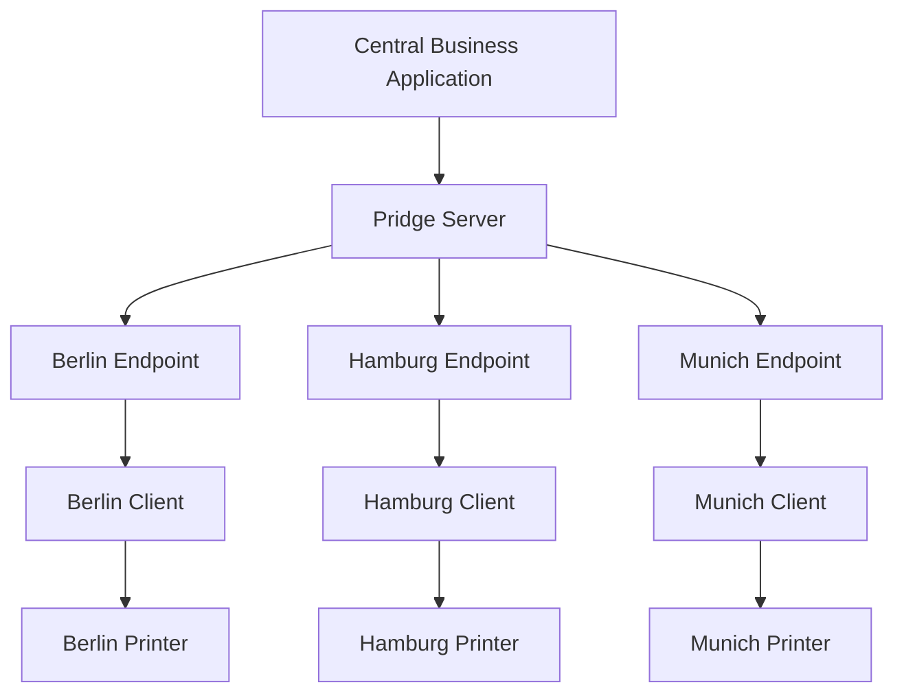

<div align="center">


# Pridge

### One bridge between your software and every printer you control.

**Open source · Self-hosted · Cross-platform · API-first · Built for real printers**

[](https://github.com/sayehava/Pridge)
[](https://github.com/sayehava/Pridge)
[](https://github.com/sayehava/Pridge)
[](https://github.com/sayehava/Pridge-Client)

<br>

[](https://github.com/sayehava/Pridge-Server)
[](https://github.com/sayehava/Pridge-Client)
[](https://github.com/sayehava/Pridge-Server/blob/main/LICENSE)
[](https://github.com/sayehava/Pridge-Client/blob/main/LICENSE)
[](LICENSE)

<br>

[Explore the ecosystem](#-official-pridge-projects)
·
[See how it works](#-how-pridge-works)
·
[View the roadmap](#-ecosystem-roadmap)
·
[Contribute](#-contributing)
·
[Support development](#️-support-development)

</div>

---

> [!IMPORTANT]
> **This repository is the official index and landing page for the Pridge ecosystem.**
>
> It does not contain the source code of the Server or Client. Each Pridge component lives in its own repository so it can be developed, versioned, released and documented independently.

---

## 📖 Table of Contents

- [What is Pridge?](#-what-is-pridge)
- [The problem Pridge solves](#-the-problem-pridge-solves)
- [Design principles](#-design-principles)
- [Color palette](#-color-palette)
- [How Pridge works](#-how-pridge-works)
- [Official Pridge projects](#-official-pridge-projects)
- [Pridge Server](#️-pridge-server)
- [Pridge Client](#️-pridge-client)
- [Feature overview](#-feature-overview)
- [Example workflows](#-example-workflows)
- [API overview](#-api-overview)
- [Deployment models](#-deployment-models)
- [Security model](#-security-model)
- [Supported platforms](#-supported-platforms)
- [Ecosystem structure](#-ecosystem-structure)
- [Roadmap](#-ecosystem-roadmap)
- [Frequently asked questions](#-frequently-asked-questions)
- [Contributing](#-contributing)
- [Licensing](#-licensing)
- [Attribution](#-required-attribution)
- [Support development](#️-support-development)

---

# ✨ What is Pridge?

**Pridge** is an open-source printing ecosystem that connects applications, websites, servers and business systems to physical printers.

It creates a secure bridge between software that produces a print job and a computer that has access to the destination printer.

A web application can submit a document or raw printer payload to a Pridge Server. A Pridge Client running in the office receives that job, maps it to the correct local printer and prints it using the operating system's native printing facilities.

Pridge is designed for situations where the software creating a job and the printer executing it do not live on the same machine or network.

Typical examples include:

- WooCommerce stores printing packing slips or shipping labels
- ERP systems printing invoices or warehouse documents
- POS systems printing receipts
- Shared-hosting applications printing to an office
- Remote servers printing to local USB or network printers
- Custom business software printing without browser dialogs
- Multiple remote queues mapped to different physical printers
- Several offices receiving jobs from one or more servers

Pridge is not one giant application. It is an ecosystem of focused components that communicate through a simple, language-neutral protocol.

---

# 🎯 The problem Pridge solves

Printing is easy when the application and printer are on the same computer.

It becomes much harder when:

- the application runs on shared hosting;
- the printer is connected to an office computer;
- the server cannot access the local network;
- the browser cannot print silently;
- different documents must go to different printers;
- jobs must be queued, retried and tracked;
- multiple locations use the same business system;
- a developer needs an API rather than a print dialog;
- the final payload must reach the printer unchanged.

Pridge separates the system into two responsibilities:

| Responsibility | Component |
|---|---|
| Receive, authenticate, queue and track jobs | **Pridge Server** |
| Connect to local printers and execute jobs | **Pridge Client** |

This separation keeps the server lightweight and makes the local client replaceable. The protocol is intentionally simple enough that additional clients can later be written in C++, Rust, C#, Go or any other suitable language.

---

# 🧭 Design principles

## 🏠 Self-hosted first

You control the server, the database, the clients, the endpoint tokens and the print history.

Pridge does not require a proprietary cloud printing provider.

## 🪶 Lightweight deployment

The current server is built with plain PHP and SQLite so it can run in environments where heavier platforms are not practical, including ordinary shared hosting.

## 🧱 Modular architecture

The Server, Client, drivers, integrations, SDKs and plugins can evolve independently.

## 🔌 API-first communication

Applications submit jobs through authenticated HTTP endpoints. Clients pull jobs using a documented API.

## 🖨️ Printer-agnostic transport

Pridge can transport PDFs, images, text and raw printer data. The Client is responsible for sending the original payload to the selected local printer.

## 🌍 Cross-platform clients

The desktop client targets Windows, macOS and Linux, with platform-specific printing backends where necessary.

## 🔐 Least-privilege access

Server endpoints and clients use separate credentials and assignments. A client receives only the queues assigned to it.

## 🧩 Extensible by design

Future drivers, plugins, integrations and alternative clients can reuse the same core protocol.

## ❤️ Open source

The ecosystem is built in public so users can inspect it, extend it, self-host it and contribute improvements.

---

# 🎨 Color palette

The [landing page](https://sayehava.github.io/Pridge/) is themed with Pridge Blue and a curated Persian jewel-tone palette! Persian Blue, Persian Red, Persian Green and Amber.

Full swatch previews, hex values and the CSS tokens behind them live in **[COLORS.md](COLORS.md)**, which also credits the [alijsh/persian-colors](https://github.com/alijsh/persian-colors/blob/master/persian-colors.css) and [color-hex.com/color-palette/372](https://www.color-hex.com/color-palette/372) references the palette draws on.

Buttons, other reusable UI pieces and cross-project design notes (Pridge Client, Pridge Server) live in **[design-language/](design-language/README.md)**.

---

# 🔄 How Pridge works



## Print job lifecycle



## Basic sequence



---

# 📦 Official Pridge projects

<div align="center">

| Project | Purpose | Technology | License | Status |
|---|---|---|---|---|
| [**Pridge Server**](https://github.com/sayehava/Pridge-Server) | Receives, authenticates, queues and tracks print jobs | PHP + SQLite | GPL-3.0-or-later + additional terms | Active |
| [**Pridge Client**](https://github.com/sayehava/Pridge-Client) | Connects remote queues to local printers | Python | GPL-3.0-or-later + additional terms | Active |
| [**Pridge Dolibarr Endpoint**](https://github.com/sayehava/Pridge-Dolibarr-Endpoint) | Sends Dolibarr Receipt Printer and TakePOS ESC/POS output to Pridge without patching Dolibarr core | PHP | GPL-3.0-or-later + additional terms | Active |
| **Pridge Index** | Central ecosystem directory and project landing page | Markdown | GPL-3.0-or-later + additional terms | You are here |
| **Virtual Printer** | Operating-system printer that sends jobs to Pridge | Native platform components | To be announced | Planned |
| **Integrations** | Connectors for shops, ERPs and business applications | Multiple | Per repository | Planned |
| **SDKs** | Reusable libraries for third-party applications | Multiple | Per repository | Planned |

</div>

---

# 🖥️ Pridge Server

[](https://github.com/sayehava/Pridge-Server)

**Pridge Server** is the central print-job broker.

It is written in plain PHP and uses SQLite for storage. It is designed to run on shared hosting, a VPS, a local server or another PHP-capable environment.

## Server responsibilities

- Receive print jobs from authenticated applications
- Store the original payload
- Maintain endpoint and client assignments
- Queue jobs for the correct clients
- Track job status
- Return timed-out reservations to the queue
- Provide an administrator interface
- Store print and cancellation history
- Preview supported payload types
- Manage endpoint tokens
- Manage client tokens
- Track client heartbeat
- Support password recovery
- Protect administration with login throttling

## Server requirements

- PHP
- PDO SQLite
- Writable storage directory
- HTTPS for production deployments
- Optional PHP `mail()` support for password recovery

## Server deployment targets

- Shared hosting
- cPanel subdomains
- Apache-compatible hosting
- VPS
- Dedicated servers
- Local development environments
- Internal business servers

## Server repository

**GitHub:**  
https://github.com/sayehava/Pridge-Server

---

# 💻 Pridge Client

[](https://github.com/sayehava/Pridge-Client)

**Pridge Client** is the local bridge between Pridge Server and printers installed on a computer.

The current implementation is written in Python. It provides a graphical configuration interface as well as a headless mode.

## Client responsibilities

- Connect to one or more Pridge Server instances
- Authenticate securely using client tokens
- Poll enabled servers independently
- Send heartbeat updates
- Download assigned endpoint queues
- Discover locally installed printers
- Map remote endpoints to local printers
- Reserve the next available job
- Send original job payloads to the selected printer
- Report printing, printed and failed states
- Store tokens securely where platform support is available
- Continue operating in background mode
- Run without requiring the end user to install Python when using packaged releases

## Multiple-server support

A single client can connect to multiple independent Pridge Server installations.

Each server profile has its own:

- server URL;
- client token;
- enabled state;
- polling interval;
- heartbeat interval;
- endpoint assignments;
- remote-to-local printer mappings;
- background worker;
- Start and Stop controls.

This makes it possible for one office computer to receive print jobs from several shops, applications, companies or server environments.

## Local printing support

The client uses platform-appropriate printing mechanisms:

| Platform | Printing approach |
|---|---|
| Windows | Native/RAW printer support |
| macOS | System printing facilities |
| Linux | CUPS integration |

Exact capabilities depend on the operating system, installed printer drivers and payload format.

## Distribution formats

The project documents self-contained release builds using:

- Nuitka native standalone builds
- PyInstaller standalone builds
- Windows GUI packages
- macOS application packages
- Portable distributions

## Client repository

**GitHub:**  
https://github.com/sayehava/Pridge-Client

---

# 🧰 Feature overview

| Feature | Server | Client |
|---|:---:|:---:|
| Shared-hosting friendly | ✅ | N/A |
| SQLite storage | ✅ | N/A |
| Admin web interface | ✅ | N/A |
| Endpoint tokens | ✅ | Uses endpoint assignments |
| Client tokens | ✅ | ✅ |
| Temporary bearer sessions | ✅ | ✅ |
| Multiple server profiles | N/A | ✅ |
| Multiple printer mappings | Manages assignments | ✅ |
| Background polling | N/A | ✅ |
| Headless mode | N/A | ✅ |
| Heartbeat tracking | ✅ | ✅ |
| Queue status tracking | ✅ | ✅ |
| Reservation timeout recovery | ✅ | ✅ |
| Job history | ✅ | Reports status |
| PDF preview | ✅ | Prints payload |
| Image preview | ✅ | Prints payload |
| Text preview | ✅ | Prints payload |
| Raw binary payloads | Stores unchanged | Sends to printer |
| Windows support | Browser/server side | ✅ |
| macOS support | Browser/server side | ✅ |
| Linux support | Browser/server side | ✅ |
| Packaged standalone builds | N/A | ✅ |
| Language-neutral protocol | ✅ | ✅ |

---

# 🧪 Example workflows

## WooCommerce shipping labels



## ERP invoices



## POS receipts


## Multiple offices



---

# 📡 API overview

The Server exposes separate API surfaces for job-producing applications and printer clients.

> [!NOTE]
> This section is an overview. Always use the documentation in the component repositories as the source of truth for current routes and request formats.

## Application or plugin API

Applications submit jobs using an endpoint token.

```http
POST /api/plugin/jobs
Authorization: Bearer ENDPOINT_TOKEN
Content-Type: application/octet-stream
X-PrintBridge-Metadata: {"source":"woocommerce","order_id":"1001"}

RAW_PRINT_PAYLOAD
```

The request body is stored as the original print payload.

## Client authentication

```http
POST /api/client/auth
Content-Type: application/json

{
  "token": "CLIENT_TOKEN"
}
```

Successful authentication returns a temporary bearer token for subsequent client operations.

## Important client routes

| Method | Route | Purpose |
|---|---|---|
| `POST` | `/api/client/auth` | Authenticate a client |
| `GET` | `/api/client/jobs` | List assigned jobs and recent status |
| `GET` | `/api/client/endpoints` | List available endpoint assignments |
| `PUT` | `/api/client/endpoints` | Synchronize endpoint assignments |
| `POST` | `/api/client/jobs/reserve` | Reserve the next pending job |
| `POST` | `/api/client/jobs/{id}/printing` | Mark a job as printing |
| `POST` | `/api/client/jobs/{id}/printed` | Confirm successful printing |
| `POST` | `/api/client/jobs/{id}/failed` | Report a failed print |
| `POST` | `/api/client/heartbeat` | Update client heartbeat |

---

# 🏗 Deployment models

## Shared hosting

```text
Internet application
        │
        ▼
Pridge Server on shared hosting
        │
        ▼
Office Pridge Client
        │
        ▼
Local printer
```

This is one of the core use cases. The Server can run directly in a subdomain document root with PHP and SQLite support.

## VPS or dedicated server

```text
Applications
     │
     ▼
Reverse proxy / HTTPS
     │
     ▼
Pridge Server
     │
     ├── Office A Client
     ├── Office B Client
     └── Warehouse Client
```

## Local-only deployment

```text
Internal application
       │
       ▼
LAN Pridge Server
       │
       ▼
Local Pridge Client
       │
       ▼
Printer
```

## Hybrid deployment

A public or hosted application can submit jobs to a hosted Pridge Server while printer clients remain inside private office networks. Clients initiate outbound connections, so the printer itself does not need to be exposed publicly.

---

# 🔐 Security model

Pridge is designed around explicit identities and assignments.

## Endpoint credentials

An endpoint token authorizes an application or integration to submit jobs to a specific logical print queue.

## Client credentials

A client token identifies a printer client. After authentication, the client receives a temporary bearer token for API calls.

## Assignment boundaries

Clients are assigned only to selected endpoints. This prevents every client from automatically receiving every queue.

## HTTPS

Production installations should use HTTPS to protect credentials and print payloads in transit.

## Local secrets

The Client can use secure operating-system token storage. When secure storage is unavailable, it falls back to a restricted local file.

## Queue reservations

A job is reserved before printing so two clients do not print the same job simultaneously. Timed-out reservations can return to the pending queue.

## Storage protection

The Server protects application and storage directories from direct web access on supported hosting configurations.

## Recommended practices

- Use HTTPS
- Use long, unique client and endpoint tokens
- Do not commit credentials to repositories
- Keep the SQLite database outside the public web root when possible
- Back up the database regularly
- Restrict server administration
- Disable unused endpoints and clients
- Keep PHP, the Client and operating-system printer drivers updated
- Review failed jobs and unexpected client activity

---

# 🖥 Supported platforms

## Server

| Environment | Status |
|---|---|
| Shared hosting with PHP and SQLite | ✅ Supported |
| cPanel subdomain | ✅ Supported |
| Apache-compatible hosting | ✅ Supported |
| VPS | ✅ Supported |
| Dedicated server | ✅ Supported |
| Local PHP development server | ✅ Supported |
| Container image | 🧭 Future possibility |

## Client

| Platform | Status |
|---|---|
| Windows x64 | ✅ Supported target |
| macOS Apple Silicon | ✅ Supported target |
| macOS Intel | ✅ Supported target |
| Linux with CUPS | ✅ Supported |
| Headless mode | ✅ Available |
| Android | 🧭 Planned ecosystem area |
| iOS | 🧭 Planned ecosystem area |

---

# 🧩 Ecosystem structure

Pridge is organized so new repositories can be added without turning one codebase into a monolith.

```text
Pridge Ecosystem
│
├── Core
│   ├── Pridge Server
│   └── Pridge Client
│
├── Drivers
│   ├── Virtual Printer
│   ├── Windows Driver
│   ├── macOS Driver
│   └── Linux Driver
│
├── Integrations
│   ├── WooCommerce
│   ├── Dolibarr
│   ├── POS Systems
│   ├── ERP Systems
│   └── Custom Business Applications
│
├── SDKs
│   ├── PHP
│   ├── Python
│   ├── JavaScript / TypeScript
│   ├── .NET
│   ├── Go
│   └── Rust
│
├── Clients
│   ├── Desktop
│   ├── Headless
│   ├── CLI
│   └── Mobile
│
├── Plugins
│   ├── Official Plugins
│   └── Community Plugins
│
├── Tools
│   ├── Diagnostics
│   ├── Queue Inspection
│   ├── Migration Tools
│   └── Development Utilities
│
├── Examples
│   ├── API Examples
│   ├── Raw Printing Examples
│   └── Integration Templates
│
└── Documentation
    ├── Server Administration
    ├── Client Deployment
    ├── Integration Development
    └── Protocol Reference
```

---

# 🗂 Repository directory

## Available now

### Core

| Repository | Description |
|---|---|
| [sayehava/Pridge-Server](https://github.com/sayehava/Pridge-Server) | PHP and SQLite print-job broker with administration, authentication, queues and client APIs |
| [sayehava/Pridge-Client](https://github.com/sayehava/Pridge-Client) | Cross-platform desktop and headless bridge from Pridge servers to local printers |
| [sayehava/Pridge](https://github.com/sayehava/Pridge) | Official ecosystem directory and landing page |
| [sayehava/Pridge-Dolibarr-Endpoint](https://github.com/sayehava/Pridge-Dolibarr-Endpoint) | Dolibarr and TakePOS integration that forwards raw ESC/POS jobs through Pridge |

## First official integration

### 🧾 Pridge Dolibarr Endpoint

[](https://github.com/sayehava/Pridge-Dolibarr-Endpoint)

The first official Pridge integration connects Dolibarr's built-in **Receipt Printers** module and **TakePOS** to Pridge without patching Dolibarr core. It registers a `pridge://` stream wrapper, captures the raw ESC/POS byte stream produced by Dolibarr and submits it to the Pridge Server plugin API over HTTPS.

- Reuses Dolibarr's existing printer configuration
- Keeps the built-in Receipt Printers module enabled
- Works with TakePOS
- Supports server profiles and endpoint tokens
- Sends raw ESC/POS bytes unchanged
- Includes a bundled test receiver and recent-print diagnostics

**Repository:** https://github.com/sayehava/Pridge-Dolibarr-Endpoint

---

## Reserved for future growth

### Drivers

| Project | Status | Repository |
|---|---|---|
| Pridge Virtual Printer | Planned | Coming later |
| Pridge Windows Driver | Planned | Coming later |
| Pridge macOS Driver | Planned | Coming later |
| Pridge Linux Driver | Planned | Coming later |

### Integrations

| Project | Status | Repository |
|---|---|---|
| WooCommerce integration | Planned | Coming later |
| Dolibarr integration | Planned | Coming later |
| POS integration kit | Planned | Coming later |
| ERP integration kit | Planned | Coming later |

### SDKs

| Project | Status | Repository |
|---|---|---|
| PHP SDK | Planned | Coming later |
| Python SDK | Planned | Coming later |
| JavaScript SDK | Planned | Coming later |
| .NET SDK | Planned | Coming later |

> [!TIP]
> Adding a new project later only requires adding a row to the correct category. The structure of this repository is intentionally prepared for a much larger ecosystem.

---

# 🛣 Ecosystem roadmap

This roadmap describes the direction of the ecosystem, not a binding release schedule.

## Phase 1: Core bridge

- [x] Lightweight PHP server
- [x] SQLite job storage
- [x] Administrator interface
- [x] Endpoint authentication
- [x] Client authentication
- [x] Client heartbeat
- [x] Queue lifecycle
- [x] Job archive
- [x] Cross-platform Python client
- [x] Remote endpoint mappings
- [x] Multiple server connections
- [x] Background workers
- [x] Headless mode
- [x] Standalone release-build documentation

## Phase 2: Distribution and usability

- [ ] Broader packaged releases
- [ ] Improved diagnostics
- [ ] Guided first-run setup
- [ ] Easier printer test jobs
- [ ] Better client logs
- [ ] Automatic update strategy
- [ ] Expanded platform testing
- [ ] Additional documentation and examples

## Phase 3: Integrations

- [ ] WooCommerce connector
- [x] Dolibarr connector
- [ ] Generic webhook module
- [ ] POS examples
- [ ] ERP examples
- [ ] Shipping-label workflows
- [ ] Invoice and packing-slip workflows

## Phase 4: Virtual printing

- [ ] Windows virtual printer
- [ ] macOS virtual printer
- [ ] Linux virtual printer
- [ ] Print-to-Pridge destination
- [ ] User-selectable remote queues
- [ ] Native operating-system print-dialog integration

## Phase 5: Developer ecosystem

- [ ] Stable protocol reference
- [ ] PHP SDK
- [ ] Python SDK
- [ ] JavaScript / TypeScript SDK
- [ ] .NET SDK
- [ ] Integration templates
- [ ] Test harness
- [ ] Mock Pridge server
- [ ] Community plugin directory

## Phase 6: Extended management

- [ ] Fleet overview
- [ ] Remote diagnostics
- [ ] Client health monitoring
- [ ] Printer availability reporting
- [ ] Advanced queue policies
- [ ] Organization and location grouping
- [ ] Optional relay services
- [ ] Enterprise-oriented extensions

---

# 💡 Why Pridge instead of direct printing?

Direct printing is often tied to a specific machine, operating system, printer driver, or printing technology.

Pridge introduces a stable boundary between the job producer and the printer executor.

| Direct approach | Pridge approach |
|---|---|
| Application must know printer details | Application targets a logical endpoint |
| Application must handle drivers or RAW printer commands | Client handles local drivers, queues, and RAW printing |
| Server must reach the local network | Client initiates the connection |
| Browser print dialog interrupts workflows | Jobs are handled by the client |
| Different systems require different printing code | Integrations use one HTTP(S) protocol |
| Limited queue visibility | Server tracks job states |
| Printer changes require application changes | Update the client mapping |
| One application per printer setup | Multiple applications can share endpoints |
| Difficult remote-office support | Offices run independently with assigned clients |

---

# 🧱 Logical endpoints

A Pridge endpoint represents a remote print destination.

It does not have to match a specific physical printer forever.

Examples:

```text
shipping-labels
receipts-front-desk
invoices-accounting
warehouse-a4
kitchen-printer
customer-service-pdf
```

The Client maps each endpoint to a local printer:

```text
shipping-labels      → Zebra ZD421
receipts-front-desk  → Epson TM-T20IV
invoices-accounting  → HP LaserJet Office
warehouse-a4         → Brother MFC
```

If a printer is replaced, the application does not need to change. Only the local mapping changes.

---

# 📄 Payloads

Pridge Server stores the original request body as the print payload.

Possible payloads include:

- PDF documents
- Images
- Plain text
- Printer-ready binary data
- ESC/POS commands
- Shipping-label formats
- Application-specific payloads supported by a client or integration

The Server can preview recognized PDFs, images and text. Unknown binary payloads remain downloadable rather than being incorrectly interpreted.

> [!WARNING]
> Sending a payload to a printer does not guarantee that the printer understands that format. The integration, operating-system driver and selected printer must be compatible with the submitted data.

---

# 🧠 Frequently asked questions

<details>
<summary><strong>Is Pridge a cloud printing service?</strong></summary>

No. Pridge is self-hostable. You can deploy the Server on infrastructure you control and run the Client on your own computers.

</details>

<details>
<summary><strong>Does the Server need to be on the same network as the printer?</strong></summary>

No. The Client runs on a machine that can access the printer and initiates communication with the Server.

</details>

<details>
<summary><strong>Can Pridge run on shared hosting?</strong></summary>

Yes. The Server is specifically designed around plain PHP and SQLite and supports shared-hosting-style deployment.

</details>

<details>
<summary><strong>Does Pridge require MySQL or PostgreSQL?</strong></summary>

The current Server uses SQLite and does not require a separate database server.

</details>

<details>
<summary><strong>Can one Client connect to several Servers?</strong></summary>

Yes. Each server profile has independent credentials, intervals, mappings and worker controls.

</details>

<details>
<summary><strong>Can one Server communicate with several Clients?</strong></summary>

Yes. Clients can be created and assigned to selected endpoints.

</details>

<details>
<summary><strong>Can different queues print to different printers?</strong></summary>

Yes. Remote endpoints are mapped to locally installed printers in the Client.

</details>

<details>
<summary><strong>Does the end user need Python installed?</strong></summary>

Not when using a properly packaged standalone Client release. Source installations require a compatible Python environment.

</details>

<details>
<summary><strong>Can the Client run without a graphical window?</strong></summary>

Yes. The current Client provides a headless mode.

</details>

<details>
<summary><strong>Does Pridge support receipt printers?</strong></summary>

It can transport raw payloads and use local printers, including receipt printers, provided the operating system, driver and payload are compatible.

</details>

<details>
<summary><strong>Does Pridge support shipping-label printers?</strong></summary>

Yes, as a workflow. The exact format must be supported by the chosen printer or its driver.

</details>

<details>
<summary><strong>Can Pridge print PDFs?</strong></summary>

Pridge can transport and preview PDFs. Actual printing behavior depends on the Client implementation and operating-system printing facilities.

</details>

<details>
<summary><strong>Can jobs be tracked?</strong></summary>

Yes. Jobs move through pending, reserved, printing, printed, failed and cancelled states.

</details>

<details>
<summary><strong>What happens if a Client reserves a job and disappears?</strong></summary>

Reserved jobs can return to pending after the reservation timeout unless the Client confirms progress.

</details>

<details>
<summary><strong>Are printed jobs deleted?</strong></summary>

They are removed from the active queue by status and remain available in the archive unless explicitly deleted.

</details>

<details>
<summary><strong>Can Pridge work only inside a LAN?</strong></summary>

Yes. A fully local deployment is possible.

</details>

<details>
<summary><strong>Can I build my own Client?</strong></summary>

Yes. The protocol is intentionally language-neutral. Consult the Server integration documentation and API routes.

</details>

<details>
<summary><strong>Can I build an integration for my own application?</strong></summary>

Yes. Applications can submit authenticated jobs through the plugin API.

</details>

<details>
<summary><strong>Will there be a virtual printer?</strong></summary>

A virtual printer is part of the planned ecosystem direction.

</details>

<details>
<summary><strong>Why are Server and Client in separate repositories?</strong></summary>

They have different runtimes, deployment models and release cycles. Separate repositories keep development and distribution clean.

</details>

<details>
<summary><strong>Is this repository the source code?</strong></summary>

No. This is the official index repository. Follow the project links to reach each component's source code.

</details>

---

# 🤝 Contributing

Pridge welcomes useful, focused contributions.

Ways to contribute include:

- report reproducible bugs;
- improve documentation;
- test builds on different operating systems;
- contribute printer compatibility findings;
- propose protocol improvements;
- build integrations;
- build alternative clients;
- add translations;
- improve packaging;
- submit security reports privately;
- help other users in discussions and issues.

## Before opening an issue

Please include:

- the affected repository;
- operating system;
- Pridge version or commit;
- printer model;
- connection type;
- payload type;
- relevant logs;
- expected behavior;
- actual behavior;
- minimal reproduction steps.

## Pull requests

Good pull requests should:

- address one focused problem;
- avoid unrelated formatting changes;
- include documentation when behavior changes;
- preserve backward compatibility where practical;
- include tests where applicable;
- avoid committing credentials, generated secrets or private print data;
- follow the license and attribution requirements of the target repository.

---

# 🐛 Bug reports

Use the issue tracker of the affected component:

- **Server bugs:**  
  https://github.com/sayehava/Pridge-Server/issues

- **Client bugs:**  
  https://github.com/sayehava/Pridge-Client/issues

- **Ecosystem/index issues:**  
  https://github.com/sayehava/Pridge/issues

Please do not post passwords, endpoint tokens, client tokens, private documents, invoices or customer data in public issues.

---

# 🔒 Security

Security-sensitive issues should not be published with working exploitation details before maintainers have had a reasonable opportunity to investigate.

Examples include:

- authentication bypass;
- token disclosure;
- arbitrary file access;
- remote code execution;
- cross-client data exposure;
- unauthorized queue access;
- direct database exposure;
- payload tampering.

Use the security reporting mechanism available in the affected repository, or contact the maintainer privately.

---

# 📜 Licensing

Every Pridge repository ships its own `LICENSE` file. All current components share the same terms.

| Repository | License |
|---|---|
| Pridge Server | GNU General Public License v3.0 or later, with additional terms under GPLv3 Section 7 |
| Pridge Client | GNU General Public License v3.0 or later, with additional terms under GPLv3 Section 7 |
| Pridge index repository | GNU General Public License v3.0 or later, with additional terms under GPLv3 Section 7 |
| Future projects | Specified in each repository |

Always check the `LICENSE` and `ADDITIONAL_TERMS.md` files in the specific repository you use.

---

# ©️ Required attribution

For projects that include the additional term under GNU GPLv3 Section 7(b), modified or redistributed interactive versions must keep the following reasonable legal notice visible in the application's **About** or **Legal Notices** section:

> Original author: Sayeh Ava Pazouki  
> Copyright © 2026 Sayeh Ava Pazouki

This attribution requirement does not otherwise change the permissions granted by `GPL-3.0-or-later`.

See:

- [`LICENSE`](LICENSE)
- [`ADDITIONAL_TERMS.md`](ADDITIONAL_TERMS.md)

---

# 👩‍💻 Author

**Sayeh Ava Pazouki**

GitHub: [@sayehava](https://github.com/sayehava)

Pridge is created and maintained as an open-source project for developers, businesses and anyone who needs a practical bridge between remote software and real printers.

---

# 🌟 Project philosophy

Pridge is built around a simple idea:

> Printing should not require a proprietary cloud, a complicated server stack or a direct network route to every printer.

Applications should be able to create jobs.

Servers should be able to queue them.

Clients should be able to print them.

Users should remain in control of the entire path.

---

# 🧭 Naming

The name **Pridge** represents the bridge between the world of software and the physical act of printing:

```text
Print + Bridge = Pridge
```

It is not only the name of one application. It is the umbrella name for the complete ecosystem.

---

# 📣 Spread the word

You can help the project without writing code:

- star the repositories;
- share Pridge with developers;
- write an integration;
- test it with unusual printers;
- document a working deployment;
- report compatibility results;
- mention Pridge in relevant communities;
- sponsor continued development.

<div align="center">

## ⭐ Official repositories

[](https://github.com/sayehava/Pridge)

[](https://github.com/sayehava/Pridge-Server)

[](https://github.com/sayehava/Pridge-Client)

</div>

---

### ❤️ Support Development

☕ **Buy Me a Coffee**  
https://buymeacoffee.com/sayehava

💜 **Ko-fi**  
https://ko-fi.com/sayehava

> [!TIP]
> Even a small donation helps fund future modules, maintenance, bug fixes, and new features.

---

<div align="center">

**Built with ❤️ by [Sayeh Ava Pazouki](https://github.com/sayehava)**

<br>

`One bridge. Every printer. Every platform.`

</div>
